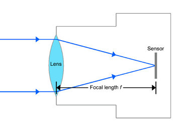
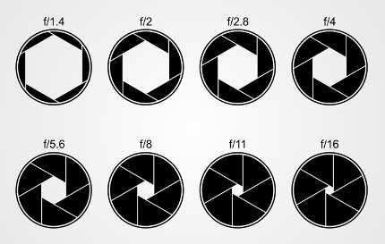
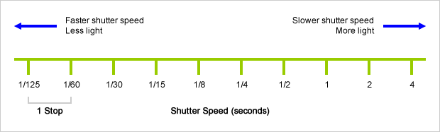
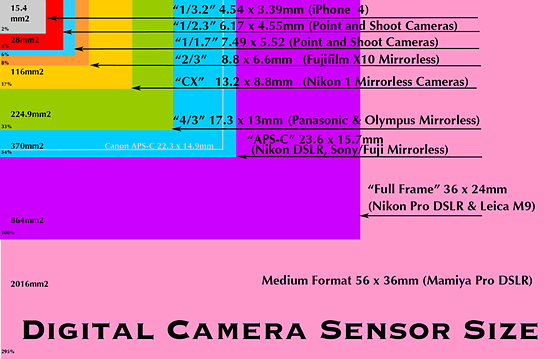
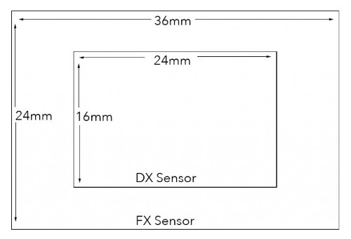

# Description: Photography Vocabulary

### Terminologies
- **Photograph**: Photo means lights and graph means writing. Photograph is writing with lights.
  
- **Camera Obscura**: Camera means room and obscura means dark. Camera Obscura is a dark room. 

- **Focal Length**: 

    
- **Aperture**:

    
- **Shutter Speed**:

    
- **Sensor**: An image sensor is a part of a camera's hardware that captures light and converts it into an image.

    - Sensor Size: 
    
    - FX Vs DX Sensor Sizes: 

- **Pixel**: Picture element.

- **DSLR**: Digital Single Lens Reflex

- **Normal Lens**: 50 mm lens.

- **Short Lens or Wide Angle Lens**: Lens shorter than 50 mm lens. 

- **Long Lens or Telephoto Lens**: Lens shorter than 50 mm lens.

- **Fixed Lens or Prime Lens**: Lens with a fixed focal lengths.

- **Zoom Lens**: Lens with variable focal lengths.

### Notes
- None

### TODOs
- None
