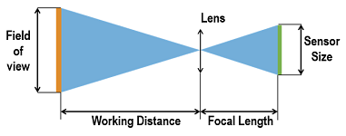
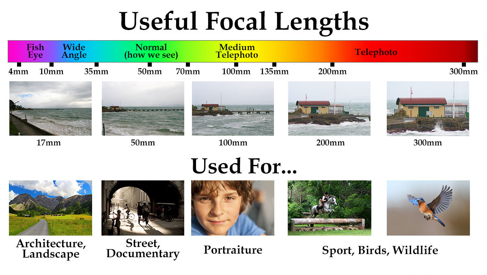
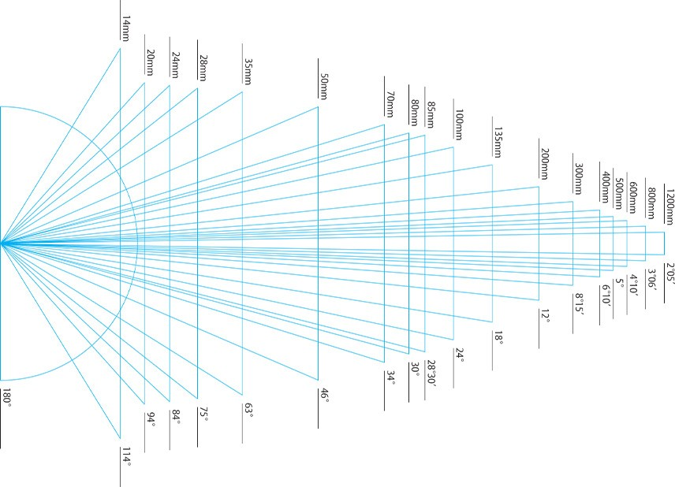
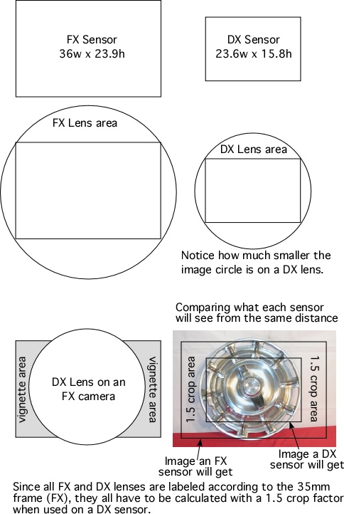
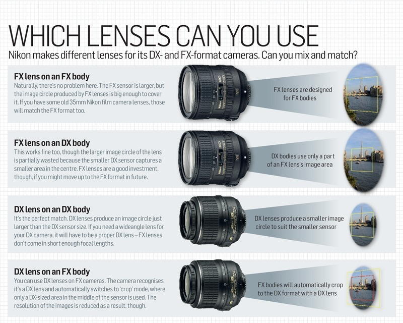

# Description: Understanding Lens

### Lens Basics

### Lens Focal Lengths

### Lens Field of View

### FX/DX Lens on FX/DX Sensor

### FX/DX Lens on FX/DX Sensor

### FX/DX Lens on FX/DX Sensor 

### Notes
- None

### TODOs
- None
