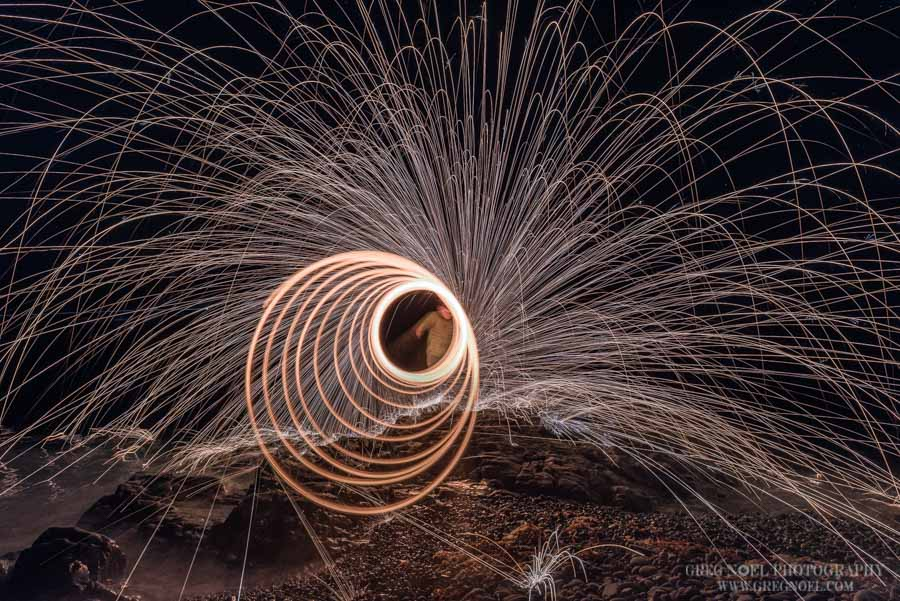
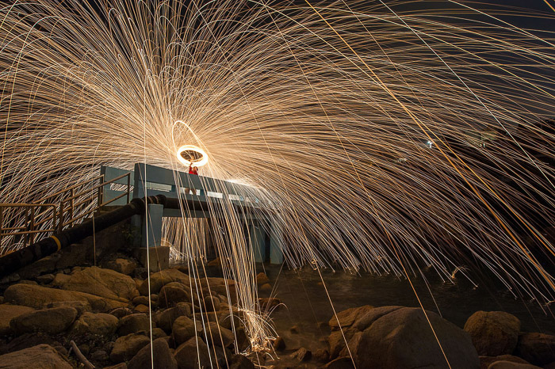

# Description: Write Here Workflow

### Requirements
* Tripod is a must.
* Use a wide angle lens.
* Use bright flashlight to help lock the focus on the subject and then switch to manual focus.
* Grade 0 Steel Wool
* String
* Stainless Steel Whisk
* Protective Gloves
* Lighter

### Initial Setup Workflow
* Mode          : Manual Mode
* ISO           : 100
* Aperture      : F9 onwards
* Shutter Speed : Blulb Mode

### Steel Wool Photography Composition Workflow
* Spin the wool behind the object.

### Steel Wool Photography Composition Ideas

### Notes
* None

### TODO
* None
