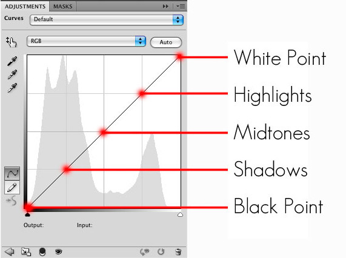
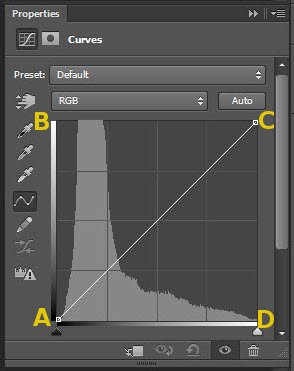
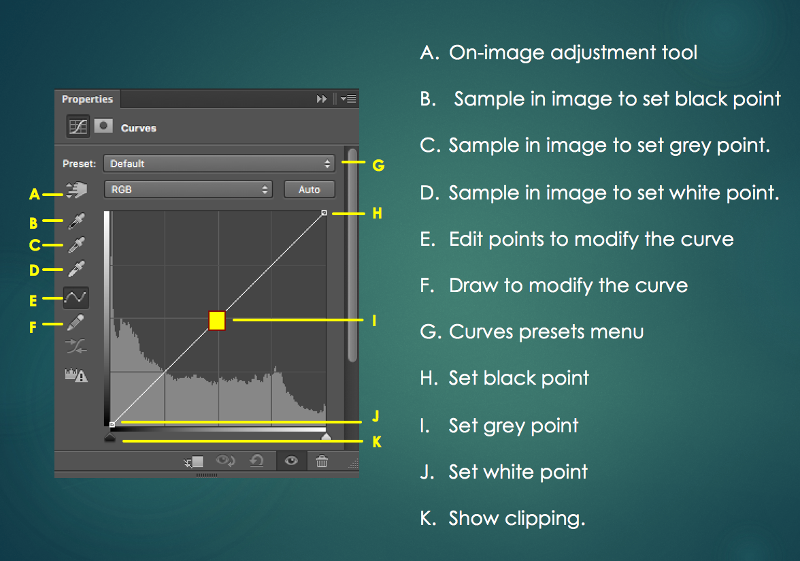

# Description: Understanding Curves

### Understanding Curves
* Tones on the Curve Lines

    

* Tinkering with the Points on the Curve Lines

    
    - The X-axis shows black on the left end to white on the right end.
    - The Y-axis shows black at the bottom end to white at the top end.
    - The curve lines stretches from A (bottom-left) corner to C (top-right) corner.
    - Convert everything to black by dragging A or C to D.
        - Dragging C to D will make the image black. This converts all the pixels between black to white on X-axis to all black (Y = 0).
        - Dragging A to D will ALSO make the image black.
    - Convert everything to white by dragging A or C to B.
        - Dragging the A to B will make the image white. This converts all the pixels between black to white on Y-axis to all white (Y = White).
        - Dragging the C to B will ALSO make the image white.
    - Create negative
        - Dragging both the corners to the opposite ends, A to B and C to D, will create a negative image. This converts all black to all white and vice-versa.

* Understanding Curves Panel

    

### Notes
* None

### TODO
* None
