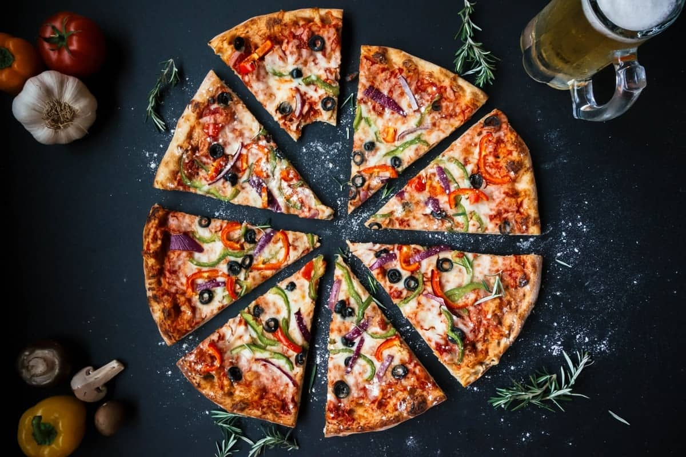

# Description: Food Photography

### Composition Ideas
* Arial Shots

* 45 Degree Angle for closeup food shots.
* Have food in the air against interesting background.
* Pull out a strand of noodles or use spoon etc for creative shots.
* Use portrait mode on iPhone 7 Plus.
* Use People face if possible.
* Edit in lightroom or snapseed.
* Aperture 7.0 or above
* 50mm Lens with 1.8 Aperture
* Use Camera Light of one and use the camera of other.
* Use paper napkins as the filter for the lights.

### Post Processing Ideas

### Camera Gears
* 35mm Lens
* 50mm Lens
* Props
    - None

### Camera Settings
* Use [Initial Setup Workflow](002-GeneralPhotographyWorkflow.md).

### Photography Workflow

### Postprocessing Workflow
* TODO

### Notes
* None

### TODO
* None
