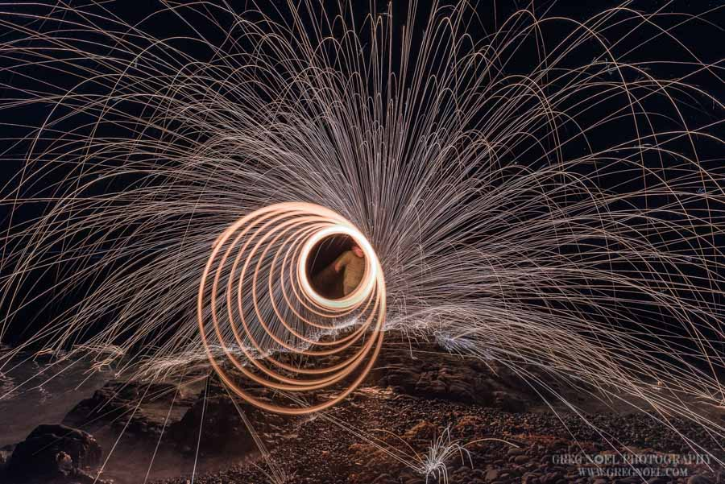
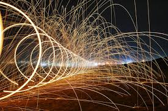
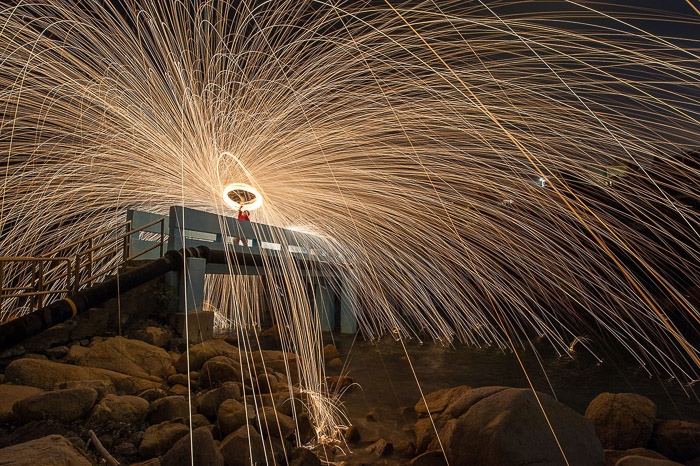
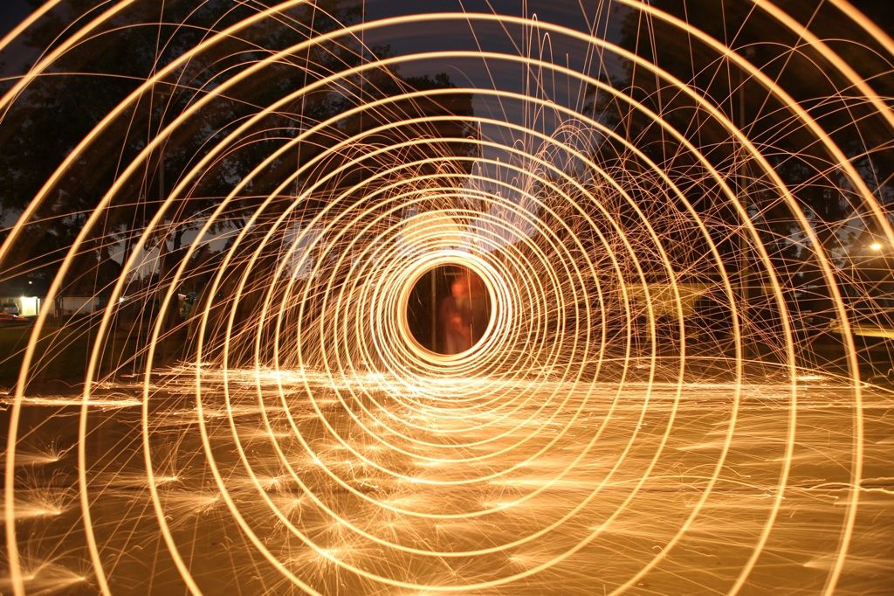

# Description: Steel Wool Photography

### Camera Gears
* WriteHere
* Props
    - None

### Requirements
* Tripod is a must.
* Use a wide angle lens.
* Use bright flashlight to help lock the focus on the subject and then switch to manual focus.
* Grade 0 Steel Wool
* String
* Stainless Steel Whisk
* Protective Gloves
* Lighter

### Camera Settings
* Mode          : Manual Mode
* ISO           : 100
* Aperture      : f8 - f11
* Shutter Speed : Blulb Mode

### Photography Workflow
* Spin the wool behind the object.
* Spinning Techniques
    - Vertical Spinning
    - Horizontal Spinning
    - Spinning while you Walk

### Photography Composition Ideas

### Composition Ideas
* None

### Notes
* First, set up your camera on the tripod and compose the image. Use a small torch to visualize where the steel wool 
  will be spinning. Set camera to aperture priority mode and manual focus. Focus with the help of a torch. Set ISO to 
  100 and aperture to f8 to f11 and then meter the scene.

### TODO
* None
