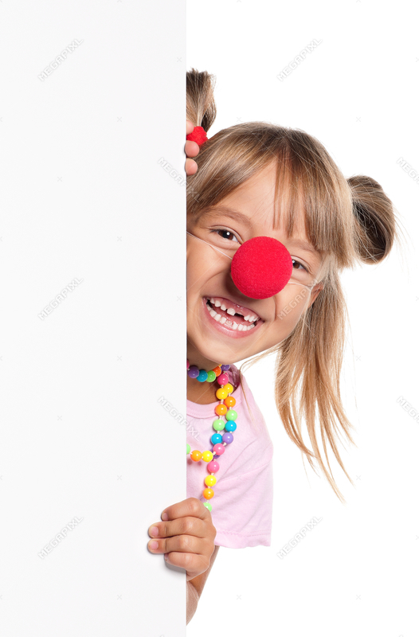

# Description: Clown Nose Photography Workflow

### Camera Gears
* Common DSLR gears
* Props
    - None

### Camera Settings
* Nikon D850
    - None
* Nikon D7200
    - None
* Nikon D90
    - None
* iPhone
    - None

### Photography Workflow
* None

### Postprocessing Workflow
* None

### Composition Ideas

### Notes
* None

### TODO
* None
