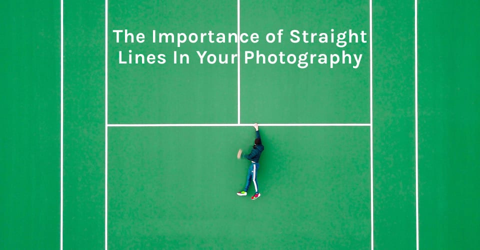
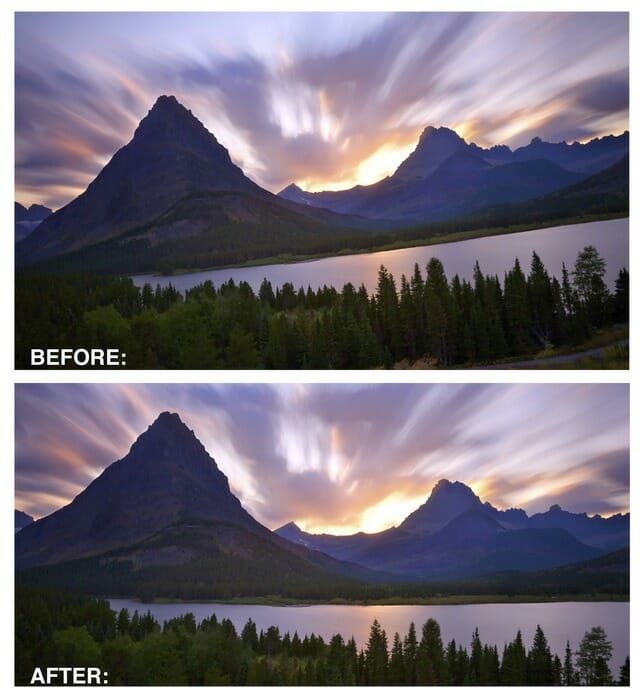
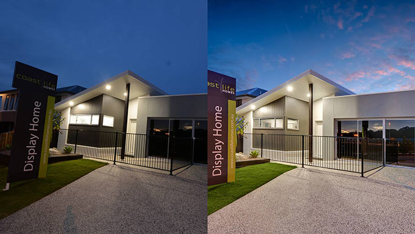
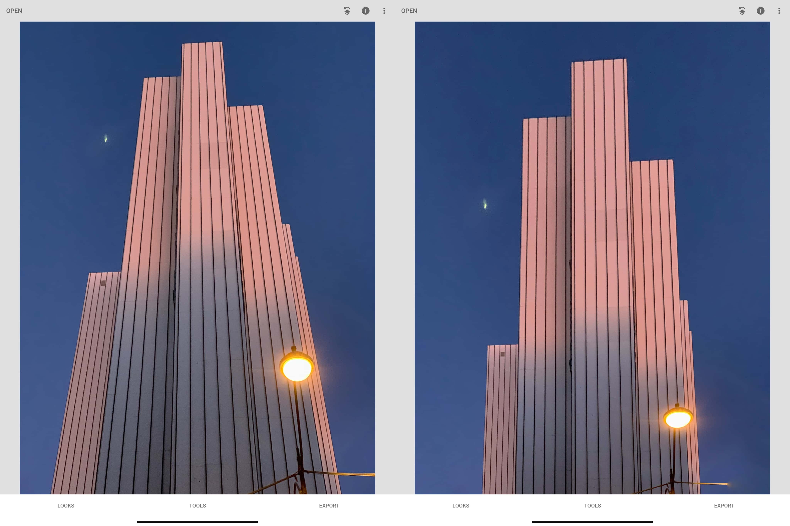
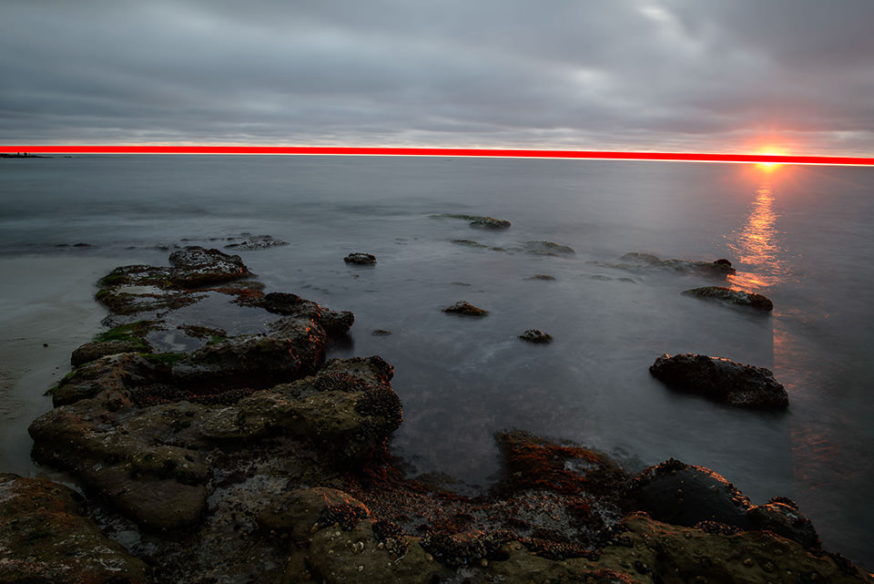
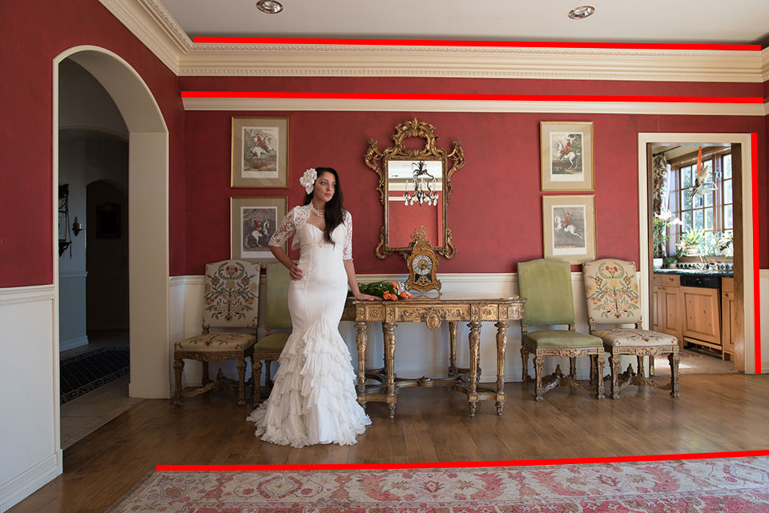
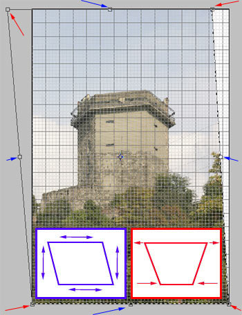

# Description: Straightening & Perspective Corrections

### Importance of Straight Lines

### Horizontal and Vertical Straightening

### Horizontal and Vertical Perspective Correction

### Straigtening & Perspective Correction Examples

### References
* [Complex Straightening](https://www.photoshopessentials.com/basics/perspective-crop-tool-photoshop/)
